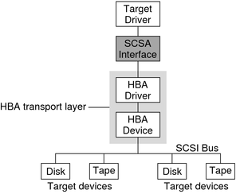

# Devices

## Table of Contents
* [Device Files](#device-files)
* [sysfs Device Path](#sysfs-device-path)
* [dd](#dd)
* [Device Names](#recognizing-a-device-by-name)
* [Creating Device FIles](#creating-device-files)
* [udev and devtmpfs](#udev-and-devtmpfs)
    * [udevadm](#udevadm)
* [SCSI and the kernel](#scsi-and-the-kernel)

Our goal in this section is to introduce you to how you can extract information about devices attached to teh system. Later details will go into more detail about specific kinds of devices.

The **udev** system **enables user-space programs to automatically configure and use new devices**.

## Device Files

It is **easy to manipulate most devices** on a Unix system because **the kernel presents many of the device I/O interfaces** to user processes **as files**. This means that programmers can use regular file operations to interact with a device.

Device files can be found in the `/dev` directory. If you navigate to this directory and run `ls -l`, you will note that the first character of each mode varies. This first character denotes the file type. 

Four of the most common file types are `b, c, p and s`.

* **Block device (b)** - Programs **access data from a block device in fixed chunks**. Disks can be easily split up into blocks of data. Because a block devices total size is fixed and easy to index, **processes have random access to any block** in the device with help from the kernel.

* **Character device (d)** - Character devices **work with data streams**. You can only read characters from or write characters to character devices. They don't have a size. When you read or write to one, the kernel usually performs a read or write operation on the device. During character device interaction, the kernel cannot back up and reexamine the data stream after it has passed data. 

* **Pipe device (p)** - Named pipes are like character devices, with another process at the other end of the I/O stream instead of a kernel driver.

* **Socket device (s)** - Sockets are a special purpose interface that are frequently used for IPC. 

```bash
/dev » ls -l                                                                                                                              
total 0
crw-------  1 root    wheel           19,   1 Dec 15 08:57 afsc_type5
crw-------  1 root    wheel           10,   3 Dec 15 08:57 auditpipe
crw-r--r--  1 root    wheel            9,   3 Dec 15 08:57 auditsessions
crw-------  1 root    wheel           21,   0 Dec 15 08:59 autofs
crw-------  1 root    wheel           33,   0 Dec 15 08:59 autofs_control
```

The numbers before the dates in the lines above correspond to **the major and minor device numbers** that help the kernel identify the device. Similar devices usually have the same major number.

## sysfs Device Path

The traditional Unix `/dev` directory is a convenient way for user processes to reference and interface with devices supported by the kernel, but it is also simplistic. The name of the device is not very descriptive, and the kernel assigns devices in the order that they are found. This can lead to a device having a different name between a reboot.

To provide a **uniform view for attached devices**, the Linux kernel offers the **sysfs interface**. The base path for devices is `/sys/devices`. Comparing the `/sys/devices` file paths and the `/dev` is like comparing apples and oranges. The `/dev` file is there so that user processes can use the device. The `sys/devices` path is used to view information and manage the device.

Let's take a look at one of the `sys/devices` directories and you will see what I mean.

```bash
lkrych@lkrych-VirtualBox:/sys/devices/LNXSYSTM:00/LNXCPU:00$ ls
hid       path           power      thermal_cooling
modalias  physical_node  subsystem  uevent
```

The files and subdirectories here are **meant to be read primarily by programs rather than humans**. There are a few shortcuts in the `sys` directory. For examples, `sys/block` should contain all the block devices available on the system. However, these are just symbolic links, you can use `ls -l` to reveal the true sysfs paths.

It can be difficult to find sysfs locations of a device. You can use the `udevadm` command to show the path and other attributes.

```bash
lkrych@lkrych-VirtualBox:/sys$ udevadm info --query=all --name=/dev/sda
P: /devices/pci0000:00/0000:00:0d.0/ata3/host2/target2:0:0/2:0:0:0/block/sda
N: sda
S: disk/by-id/ata-VBOX_HARDDISK_VBb27b1526-ecdec596
S: disk/by-path/pci-0000:00:0d.0-ata-1
E: DEVLINKS=/dev/disk/by-id/ata-VBOX_HARDDISK_VBb27b1526-ecdec596 /dev/disk/by-path/pci-0000:00:0d.0-ata-1
E: DEVNAME=/dev/sda
E: DEVPATH=/devices/pci0000:00/0000:00:0d.0/ata3/host2/target2:0:0/2:0:0:0/block/sda
E: DEVTYPE=disk
#blah blah blah blah
```

We'll cover the udev system in more detail soon.

## dd 

The program `dd` is very useful when working with block and character devices. The **sole function of this program is to read from an input file or stream and write to an output file or stream**. It copies data in blocks of a fixed size. Here's an example of how to use dd with a character device.

```bash
lkrych@lkrych-VirtualBox:~$ ls
Desktop    Downloads         Music     Public     Videos
Documents  examples.desktop  Pictures  Templates
lkrych@lkrych-VirtualBox:~$ dd if=/dev/zero of=zeros bs=32 count=1
1+0 records in
1+0 records out
32 bytes copied, 0.000202533 s, 158 kB/s
lkrych@lkrych-VirtualBox:~$ ls
Desktop    Downloads         Music     Public     Videos
Documents  examples.desktop  Pictures  Templates  zeros
```

* if - input file
* of - output file
* bs - the block size. `dd` reads and writes this many bytes of data at a time.
* count - the total number of blocks to copy

## Recognizing Devices by name

This will be an imperfect science, but here we go.

* **Hard Disks** - `/dev/sd*` - Entire disks will be represented with `/dev/sda`, `/dev/sdb`. The kernel will make separate device files for partitions: `dev/sd1`, `dev/sd2`. The naming is derived from SCSI disk, where SCSI stands for small computer system interface. SCSI was originally developed as a hardware and protocol standard for communication between devices and other peripherals. THe SCSI hardware isn't used much, but the protocol is used everywhere.
* **CD and DVD drives** - `/dev/sr*`
* **Terminals** - `/dev/tty*`,` /dev/pts/*` - Terminals are devices for moving characters between a user process and an I/O device. The terminal device interface goes back a long way. The `/dev/tty` device is the controllinng terminal of the current process. Linux has two primary display modes for terminals, text mode and X Window System server.
* **Serial Ports** -  `/dev/ttyS*` - USB devices show up here.

## Creating Device Files

**In modern Linux systems you do not create your own device file**, this is done with **devtmpfs and udev**. However, you can see how it was once done.

```bash
mknod /dev/sda1 b 8 2
```

The previous command creates a disk device file where `b 8 2` correspond to a block device with a major device number of 8and a minor device number of 2. This command is typically only useful in modern systems for created a named pipe device. 

## udev and devtmpfs

Device files are created by **udev** and **devtmpfs**. udev is a user-space process, `udevd`. When the kernel detects a new device on the system, the kernel sends a message to `udevd`. Upon receiving a message, `udevd` **investigates the device, creates a device file, and then performs device initialization**.

There is one problem with this approach. Device files are necessary very early in the boot process. `devtmpfs` was developed in response to the problem of device availability at boot. This filesystem is similar to the older devfs , but it is simplified. Basically, the kernel creates device files as necessary, but it also notifies `udevd` that a new device is available. Upon receiving this signal, `udevd` does not create the device files, but does initialization. Additionally it creates a bunch of symbolic links in `/dev`.  If this doens't make much sense, that's okay. We'll come back to it in later chapters about the filesystems and the boot process.

How does `udevd` work?

1. The kernel sends `udevd` a notification event, called a `uevent`, through an internal network link.
2. `udevd` loads all the attributes in the `uevent`.
3. `udevd` parses its rules and it takes actions based on those rules.

### udevadm

The `udevadm` program is an administration tool for `udevd`. You can reload rules and trigger events, but the most useful thing about it is the ability to [search for](#sysfs-device-path) and explore system devices as well as the ability to monitor `uevents` that the `udevd` process receives from the kernel.

To monitor `uevents`, use the monitor command.

```bash
udevadm monitor --kernel --subsystem=scsi
```

## SCSI and the kernel



[src](https://docs.oracle.com/cd/E18752_01/html/816-4854/figures/scsihba.scsadiagram.png)

The traditional SCSI hardware setup is a host adapter linked to a chain of devices over an SCSI bus. The host adapter is the interface between the computer and the devices. The host adapter and devices each have an SCSI ID. 

```bash
lkrych@lkrych-VirtualBox:~$ lsscsi
[0:0:0:0]    cd/dvd  VBOX     CD-ROM           1.0   /dev/sr0 
[2:0:0:0]    disk    ATA      VBOX HARDDISK    1.0   /dev/sda
```

In the example above, I am using the `lsscsi` utility to list all devices that are using the scsi system. In first column are a series of numbers inside brackets. These numbers represent:
1. the SCSI host adapter number
2. the SCSI bus number
3. the device SCSI ID
4. The LUN (logical unit number), a further subdivision of a device

These allow each entity to be individually identified and controlled. When a system process uses a block device interface and read/writes to it the following series of actions are taken.

1. The block device interface communicates with the SCSI subsystem. The top layer of this subsystem handles operations for the class of a device. For instance, is it a disk or an optical drive. This top layer translates the kernel block device interface into disk-specific commands in the SCSI protocol.
2. The middle layer moderates and routes the SCSI messages between the top and bottom layers and keeps track of all the SCSI buses and devices.
3. The bottom layer handles the hardware-specific actions. The drivers here send outgoing SCSI protocol messages to specific host adapters or hardware, and they extract incoming messages from the hardware.


[src](https://programmer.group/images/article/5b58a117c8cd8ac5f3c39b821805edcc.jpg)